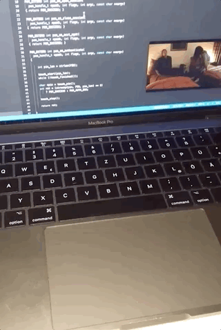

pamtouch
========

Unlock your Mac by entering a PIN on the touchpad. You may use this module to extend or replace the default password login. This is just a proof of concept and probably lacks security.



## Build

Just run `make`.

## Installation

Place `pamtouch.so` somewhere (e.g. `/usr/local/lib/security/`) and add a line for it in your pam configuration. There are multiple files for different purposes like screensaver or sudo.

```
leons-mbp:pamtouch leon$ sudo cat /etc/pam.d/screensaver
# screensaver: auth account
auth       optional       pam_krb5.so use_first_pass use_kcminit
auth       required       pam_opendirectory.so use_first_pass nullok
auth       required       /usr/local/lib/security/pamtouch.so
account    required       pam_opendirectory.so
account    sufficient     pam_self.so
account    required       pam_group.so no_warn group=admin,wheel fail_safe
account    required       pam_group.so no_warn deny group=admin,wheel ruser fail_safe
```
